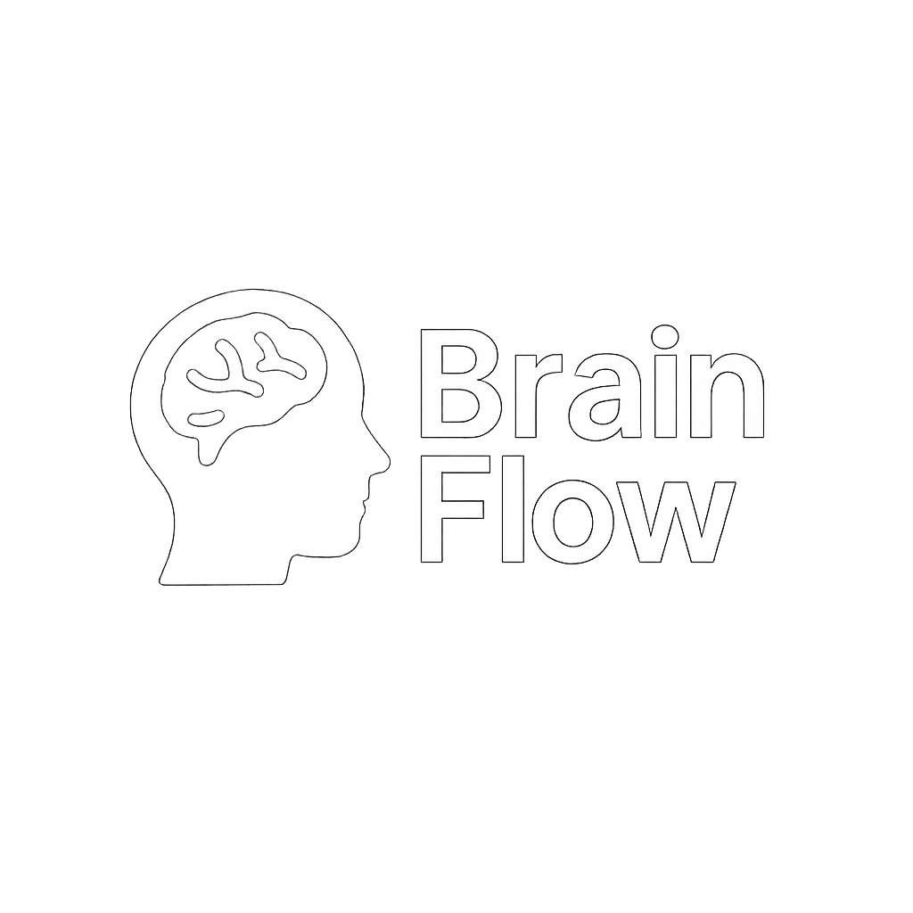

# Brain Flow - Plataforma de Cursos Online

<div align="center">
  
  
  **Plataforma educacional moderna para criação e distribuição de cursos online**
  
  [](https://dotnet.microsoft.com/)
  [](LICENSE)
  []()
</div>

---

## Sobre o Projeto

O **Brain Flow** é uma plataforma de ensino online desenvolvida como Trabalho de Conclusão de Curso (TCC), que permite a criação, gerenciamento e distribuição de cursos digitais. A plataforma oferece um ambiente completo para instrutores e estudantes, com sistema de afiliados, pagamentos e acompanhamento de progresso.

### Objetivos

- **Educação Acessível**: Democratizar o acesso ao conhecimento através de uma plataforma moderna
- **Sistema de Afiliados**: Permitir que criadores de conteúdo monetizem seus cursos
- **Analytics Completo**: Fornecer dados detalhados sobre performance dos cursos
- **Interface Moderna**: Experiência de usuário intuitiva e responsiva

---

## Funcionalidades

### Para Estudantes (Usuário Comum)
- **RF2.5**: Navegação e busca de cursos disponíveis
- **RF2.6**: Visualização detalhada com acesso a aulas gratuitas
- **RF2.7**: Acompanhamento de progresso das aulas
- **RF3.1**: Processo de compra e checkout
- **RF5.1**: Participação em fórum de discussões
- **RF1.6**: Gestão de perfil pessoal

### Para Afiliados
- **RF2.1**: Criação e edição de cursos próprios
- **RF2.2**: Organização em módulos e aulas hierárquicas
- **RF2.3**: Adição de conteúdo em vídeo
- **RF2.4**: Marcação de aulas gratuitas para demonstração
- **RF4.1**: Dashboard com vendas e comissões
- **RF4.2**: Página pública personalizada para seus cursos

### Para Administradores
- **RF1.5**: Aprovação/reprovação de cadastros de afiliados
- **RF4.3**: Painel central de administração
- **RF4.4**: Visualização de indicadores empresariais
- **RF3.6**: Gestão de repasses de comissões

---

## Arquitetura do Sistema

O projeto segue uma arquitetura em camadas bem definida:

```
BrainFlow/
├── BrainFlow.Data/           # Modelos de dados e entidades
│   ├── AfiliadoMOD.cs
│   ├── CursoMOD.cs
│   ├── UsuarioMOD.cs
│   └── ...
├── BrainFlow.Repository/     # Camada de acesso a dados
│   ├── Context/
│   ├── Interfaces/
│   └── Repositories/
└── BrainFlow.UI.Web/         # Interface web e controllers
    ├── Controllers/
    ├── Views/
    ├── wwwroot/
    └── ViewModels/
```

### Tecnologias Utilizadas

| Categoria | Tecnologia | Versão |
|-----------|------------|--------|
| **Backend** | .NET Core | 9.0 |
| **Frontend** | HTML5, CSS3, JavaScript | - |
| **Banco de Dados** | Entity Framework Core | 9.0.9 |
| **Segurança** | BCrypt.Net-Next | 4.0.3 |
| **UI/UX** | CSS Grid, Flexbox, Animations | - |

---

## Design System

### Paleta de Cores
```css
:root {
  --navy: #0f2741;           /* Azul principal */
  --navy-600: #173652;       /* Azul secundário */
  --accent: #f0b41b;         /* Dourado de destaque */
  --accent-600: #d59f14;     /* Dourado escuro */
  --text: #1f2b3a;           /* Texto principal */
  --muted: #6b7a90;          /* Texto secundário */
  --line: #e4e9f0;           /* Bordas */
  --bg: #f7f9fc;             /* Fundo */
}
```

## Como Executar

### Pré-requisitos

- [.NET 9.0 SDK](https://dotnet.microsoft.com/download)
- [Visual Studio 2022](https://visualstudio.microsoft.com/) ou [VS Code](https://code.visualstudio.com/)
- SQL Server (LocalDB ou completo)

### Instalação

1. **Clone o repositório**
   ```bash
   git clone https://github.com/mezunnk/TCCBrain.git
   cd TCCBrain
   ```

2. **Restaure as dependências**
   ```bash
   dotnet restore
   ```

3. **Configure o banco de dados**
   ```bash
   dotnet ef database update --project BrainFlow.Repository
   ```

4. **Execute a aplicação**
   ```bash
   dotnet run --project BrainFlow.UI.Web
   ```

5. **Acesse no navegador**
   ```
   https://localhost:5001
   ```

---

## Estrutura de Páginas

### Páginas Principais
- **`/`** - Página inicial com cursos em destaque
- **`/cursos`** - Catálogo completo de cursos
- **`/curso/{id}`** - Detalhes e reprodução do curso
- **`/perfil`** - Perfil do usuário com abas organizadas

### Área Administrativa
- **`/admin/dashboard`** - Painel administrativo
- **`/admin/usuarios`** - Gestão de usuários
- **`/admin/cursos`** - Gestão de cursos

### Sistema de Afiliados
- **`/afiliado/dashboard`** - Dashboard do afiliado
- **`/afiliado/{id}`** - Página pública do afiliado

---


## Status do Projeto

| Módulo | Status | Implementação |
|--------|--------|---------------|
| Autenticação | Completo | 100% |
| Models/Entidades | Completo | 100% |
| Interface Web | Completo | 95% |
| Sistema Afiliados | Interface Completa | 80% |
| Sistema de Pagamentos | Estrutura Criada | 40% |
| Controllers de Negócio | Em Desenvolvimento | 60% |
| Upload de Conteúdo | Planejado | 0% |
| Mobile | Planejado | 0% |

---

## Licença

Este projeto está sob a licença MIT. Veja o arquivo [LICENSE](LICENSE) para mais detalhes.


---

<div align="center">
  <p><strong>Desenvolvido com dedicação para democratizar a educação</strong></p>
  <p>Se este projeto te ajudou, deixe uma star!</p>
</div>